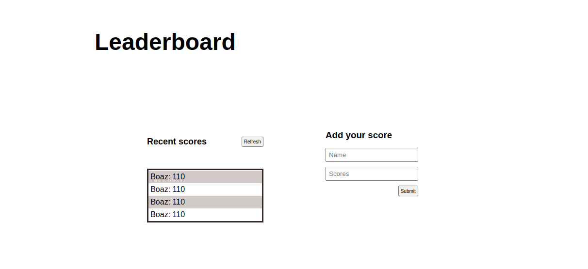

# Leaderboard

> This is a leaderboard Application that displays scores of a game from an REST API.

## Built With

- Major languages
  - HTML
  - Javascript
  - CSS
- Technologies used
  - npm
  - webpack

<!-- ## Live Demo (if available) -->

<!-- [Live Demo Link](https:/) -->

## Getting Started

To get a local copy up and running follow these simple steps.

### Prerequisites

- npm
- git

### Setup

- open terminal or bash
- run
  - `git clone https://github.com/Aduda-Boaz/leaderboard.git`

### Install

- run
  - `cd leaderboard`
  - `npm install`
  - `npm run build`
  - `npm start` to run the server

### Deployment

- run
  - `npm run build`

👤 **Aduda Boaz**

- GitHub: [@Aduda-Boaz](https://github.com/Aduda-Boaz)
- Twitter: [@BoazAduda](https://twitter.com/BoazAduda)
- LinkedIn: [LinkedIn](https://linkedin.com/in/boaz-aduda)

## 🤝 Contributing

Contributions, issues, and feature requests are welcome!

Feel free to check the [issues page](https://github.com/Aduda-Boaz/leaderboard/issues).

## Show your support

Give a ⭐️ if you like this project!s
